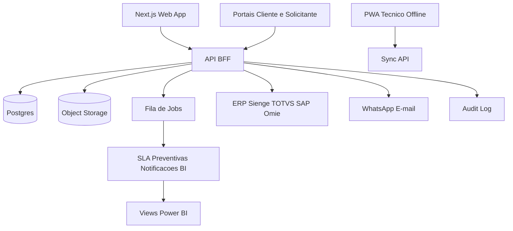

# Arquitetura Tecnica

## Decisao inicial

O MVP deste workspace foi implementado como PWA estatico sem dependencias externas para validar UX, fluxos e regras de negocio rapidamente. A evolucao recomendada e migrar a camada de dados para Postgres/Supabase ou Postgres gerenciado com API TypeScript.

## Estado atual da Fase 1

A fundacao SaaS foi iniciada no prototipo com:

- Sessao simulada por usuario e perfil.
- Alternancia de tenant ativo.
- Matriz RBAC local.
- Cadastros base de clientes, sites e locais.
- Checklist visual de provisionamento.

Esta camada ainda usa `localStorage`. A proxima decisao de arquitetura e substituir esse armazenamento por API + Postgres mantendo o mesmo contrato funcional da UI.

## Alvo de producao

## Componentes

- Frontend: Next.js, React, TypeScript, Tailwind/shadcn.
- Backend: NestJS ou Next.js API modular.
- Banco: PostgreSQL com tenant_id, RLS, migrations e views de BI.
- Auth: Supabase Auth, Clerk ou Auth.js, com RBAC de dominio.
- Offline: IndexedDB, fila local, versao por entidade e resolucao de conflitos.
- Jobs: geracao de preventivas, calculo SLA, notificacoes, medicao e exportacoes.
- Storage: fotos, assinaturas, PDFs, documentos de contrato e evidencias.
- Observabilidade: Sentry, logs estruturados e auditoria de negocio.

## Principios

- Isolamento por tenant desde a primeira migration.
- Toda OS precisa de historico, status e trilha de eventos.
- Medicao nunca sobrescreve valor original; glosa e justificativa sao eventos separados.
- Checklist e templates sao versionados.
- Integracoes publicam eventos por webhook antes de conectores dedicados.
